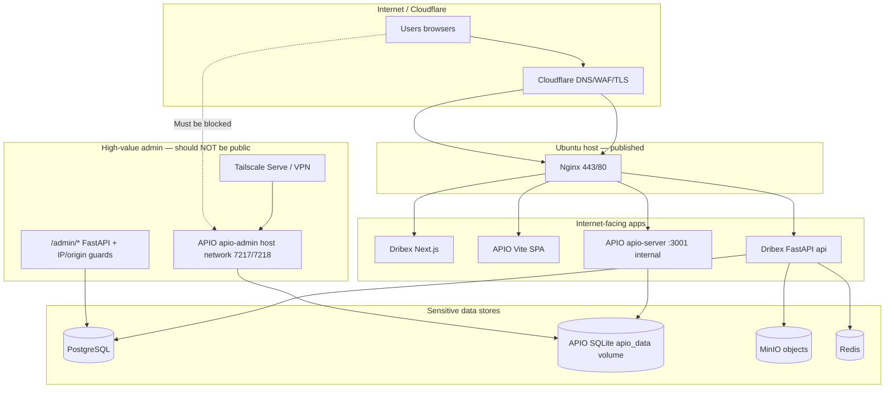

# Architecture and attack surface — Dribex & APIO

**Audit date:** 2026-10-10 | **Method:** Repository static analysis (no live prod SSH).

## Service inventory

| Service | Stack | Repo path | Typical production entry |
|---------|--------|-----------|---------------------------|
| Dribex storefront | Next.js 15, next-intl | `souq-local/web` | `https://dribex.ma/` (nginx → web) |
| Dribex API | FastAPI, async SQLAlchemy, Alembic | `souq-local/backend` | `https://api.dribex.ma` or nginx proxy to `margem-prod-api-1` |
| APIO public SPA | Vite/React | `souq-local/apio` + nginx | `https://dribex.ma/APIO/` |
| APIO public API | Node/Express, SQLite | `souq-local/apio/server` (`index.js`) | `https://dribex.ma/APIO/api/*` |
| APIO super-admin | Node/Express + admin SPA | `adminIndex.js`, port **7217/7218** | **Tailscale / loopback** (not public SPA) |
| PostgreSQL | 16 | Compose `postgres` | **internal** network only |
| Redis, MinIO, Vault | Compose | `docker-compose.prod.yml` | **internal** |
| Observability | Prometheus, Grafana, Loki | on-prem compose | Typically internal / operator |
| Mobile | Flutter | `souq-local/mobile` | Public API URL |
| CI | GitHub Actions | `.github/workflows/margem-ci.yml` | pytest, gitleaks, pip-audit, compose config |

**Historical leads (unverified live):** container `margem-prod-api-1`, APIO admin `127.0.0.1:7217`, Cloudflare 522 on health, Google Sign-In SHA rebuild.

## Trust boundaries

## Public entry points (from repo config)

| Entry | Exposure | Notes |
|-------|----------|--------|
| `dribex.ma` / `www` | Public | Storefront + `/APIO/*` |
| `api.dribex.ma` | Public | Core marketplace API |
| `/APIO/api/*` | Public | Rate limits in nginx snippet |
| `/APIO/admin`, `/APIO/api/admin/*` | **Allowlist + deny all** in nginx | Still proxies to **public** `apio-server` if misconfigured; primary admin is **7217** container |
| APIO admin `:7217/:7218` | **Intended private** | `network_mode: host`, bind from `.env.apio.prod` |
| Postgres/Redis/MinIO | **Not published** in prod compose | Correct pattern |

## Authentication providers

| System | Mechanisms |
|--------|------------|
| Dribex | Email/password, JWT access tokens, refresh sessions, Google OAuth, MFA for staff/admin (config) |
| APIO public | Cookie `apio_token`, bcrypt passwords, email verify, password reset tokens, Google OAuth |
| APIO admin | Separate cookie `apio_admin_token`, JWT `aud: apio-admin`, `SUPER_ADMIN` role from DB |

## Data flows (sensitive)

- **PII:** user email, name, phone, messages, seller profiles → PostgreSQL (Dribex) / SQLite (APIO).
- **Credentials:** password hashes only in DB; JWT secrets in env (not in repo values).
- **Media:** MinIO (Dribex); `/data/uploads` volume (APIO).
- **Audit:** `admin_audit_log` (APIO); application logs (both).

## Outbound dependencies

- SMTP / Brevo email, Google OAuth token endpoints, Sentry (if enabled), Cloudflare (DNS/TLS termination).

## Attack surface priorities (audit order applied)

1. Internet-exposed admin (APIO 7217, Dribex `/admin/*`, nginx allowlist bypass).
2. AuthN/AuthZ on all mutating APIs.
3. Published ports and secrets in Git/CI.
4. Injection and file upload paths.
5. Container/host hardening and backups.

See `ENDPOINT_AUTHORIZATION_MATRIX.md` for route-level detail.
